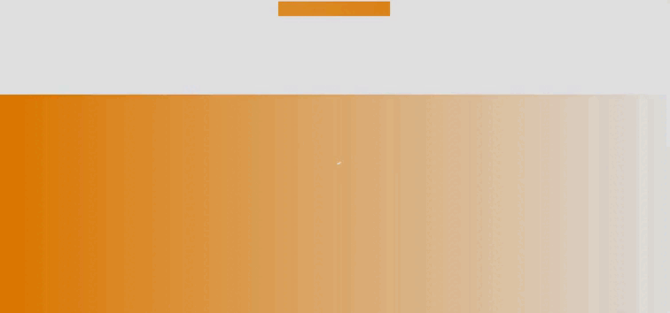

<div style="background-color: #ffA500; padding: 20px; border-radius: 10px; margin-bottom: 20px;">
  
  
  [](https://git.io/typing-svg)

  
</div>

[](https://skillicons.dev)
---

Meu sistema de login React é uma solução eficiente e responsiva para agilizar o desenvolvimento de sistemas. Aqui estão alguns destaques do projeto:

- **Gerenciamento de Usuários:** Utiliza cookies e cripto-js para um gerenciamento seguro e eficaz de usuários.
- **Responsivo:** Garante uma experiência consistente em dispositivos de diferentes tamanhos, proporcionando flexibilidade.
- **Fácil Integração:** Projetado para facilitar a integração em diversos ambientes de desenvolvimento.

---

<div align="center">
  <p><strong>Observação:</strong> A imagem sofreu redução de qualidade devido à conversão de vídeo para GIF. 😉</p>
  
</div>

---

### Configuração do Backend e Frontend

Para fins de segurança e preservação de identificadores de cookies, a configuração entre o backend e frontend é feita através do arquivo `.env`. É necessário configurar apenas a chave de sua escolha:

```env
REACT_APP_COOKIE_ID_UUID=[SEU IDENTIFICADOR COOKIE AQUI]
REACT_APP_COOKIE_ID_NAME=[SEU IDENTIFICADOR COOKIE AQUI]
REACT_APP_COOKIE_ID_NUMB=[SEU IDENTIFICADOR COOKIE AQUI]
REACT_APP_ENCRYPTION_KEY=[SEU IDENTIFICADOR COOKIE AQUI]
